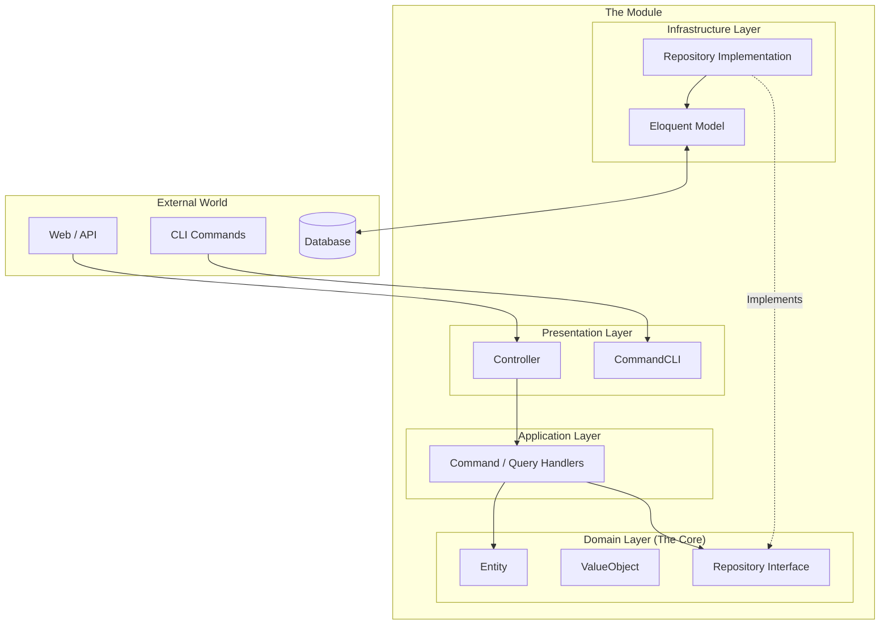
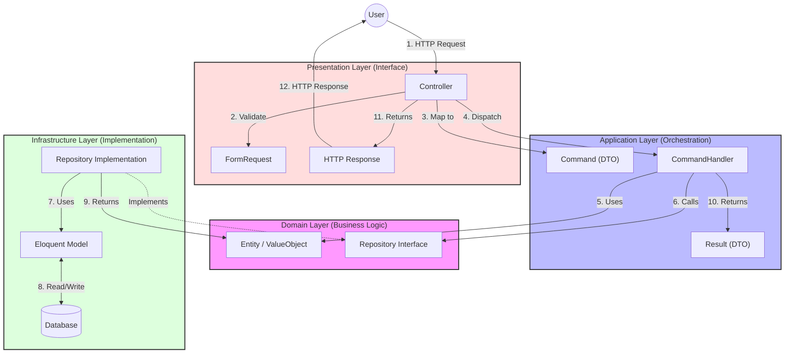
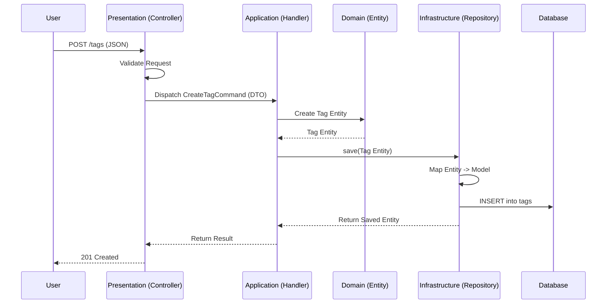
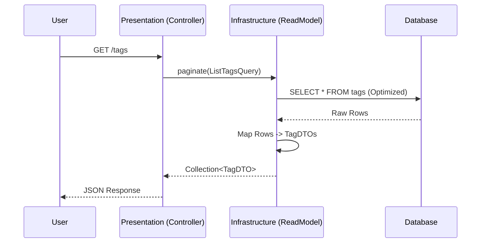

# 🏗️ How to Create a DDD Module in Laravel

**Standard Operating Procedure (SOP) for Modular Monolith Architecture**

This guide outlines the mandatory process for creating new modules following **Domain-Driven Design (DDD)** principles. It serves as the "source of truth" for architectural decisions.

## 📋 Table of Contents

1. [Philosophy & Architecture](#1-philosophy--architecture)
2. [Directory Structure Explained](#2-directory-structure-explained)
3. [Layer Communication & Data Flow](#3-layer-communication--data-flow)
4. [Best Practices & Conventions](#4-best-practices--conventions)
5. [Step-by-Step Implementation Guide](#5-step-by-step-implementation-guide)

---

## 1. 🧠 Philosophy & Architecture

We adopt a **Hexagonal (Ports & Adapters)** inspired architecture, organized into four distinct layers. The goal is to isolate the **Domain** (Business Logic) from the **Infrastructure** (Framework & Database).

### High-Level Architecture



---

| Layer | Purpose | Primary Responsibility | Dependencies |
| :--- | :--- | :--- | :--- |
| **Domain** | **The Core** | Business rules, Entities, Logic. Pure PHP. | **None** (Strictly forbidden to depend on others) |
| **Application** | **The Orchestrator** | Coordinates use cases (What the app *does*). | Depends on **Domain** |
| **Infrastructure** | **The Implementation** | Database, Mail, Files, Framework integration. | Depends on **Domain**, **Application**, **Framework** |
| **Presentation** | **The Interface** | HTTP entry points, Input validation, JSON/View response. | Depends on **Application**, **Domain** |

## 2. 📂 Directory Structure Explained

Every module must follow this exact structure.

```text
app-modules/{module-name}/
├── composer.json               # 📦 Module definition & Autoloading config
├── database/
│   ├── factories/              # 🏭 Eloquent Factories (for Tests)
│   ├── migrations/             # 🗄️ Database Schema Migrations
│   └── seeders/                # 🌱 Database Seeders
├── src/
│   ├── Application/
│   │   ├── CommandHandlers/    # Write Logic (e.g., CreateTagHandler)
│   │   ├── Commands/           # Write DTOs (e.g., CreateTagCommand)
│   │   ├── DTOs/               # Read DTOs (Data Transfer Objects for UI)
│   │   ├── Queries/            # Read Requests (e.g., ListTagsQuery)
│   │   ├── QueryContracts/     # Interfaces for reading data (e.g., TagQueryRepository)
│   │   └── QueryHandlers/      # Logic for reading data
│   ├── Domain/
│   │   ├── Entities/
│   │   │   # Rich Objects with ID (e.g., Tag)
│   │   ├── Events/
│   │   │   # Domain Events (e.g., TagCreated)
│   │   ├── Exceptions/
│   │   │   # Business Rule Violations (e.g., DuplicateSlugException)
│   │   ├── Repositories/
│   │   │   # Interfaces for Persistence (Write only)
│   │   ├── Services/
│   │   │   # Complex Domain Logic spanning multiple entities
│   │   └── ValueObjects/
│   │       # Immutable properties (e.g., TagName, TagSlug)
│   ├── Infrastructure/
│   │   ├── Listeners/
│   │   │   # Event Listeners
│   │   ├── Persistence/
│   │   │   # Database Implementation
│   │   │   ├── Eloquent/
│   │   │   │   ├── Mappers/
│   │   │   │   │   # Entity <--> Model Converter
│   │   │   │   ├── Models/
│   │   │   │   │   # Eloquent Models (Active Record)
│   │   │   │   ├── ReadModels/
│   │   │   │   │   # Query Implementations (Returns DTOs)
│   │   │   │   └── Repositories/# Repository implementations (Saves Entities)
│   │   └── Providers/
│   │       # Service Provider (Wiring everything together)
│   └── Presentation/
│       ├── Controllers/
│       │   # HTTP Controllers (Inertia/API)
│       ├── Mappers/
│       │   # Request -> Command Mappers
│       ├── Policies/
│       │   # Authorization Rules (Gates)
│       ├── Requests/
│       │   # Input Validation (FormRequest)
│       └── Routes/
│           # Route Definitions (web.php)
└── tests/
    ├── Feature/                # Integration Tests (Controller -> DB)
    └── Unit/                   # Unit Tests (Domain Logic)
```

---

## 3. 🔄 Layer Communication & Data Flow

### Rules of Engagement

1. **Strict Dependency Flow:** Dependencies point *inwards*.
    * `Presentation` -> `Application`
    * `Application` -> `Domain`
    * `Infrastructure` -> `Domain`
2. **No Skipping:** `Presentation` never talks to `Infrastructure` directly.
3. **Boundary Objects:** Use **DTOs** (Commands/Queries) to cross boundaries.

### Communication Flow Diagram



---

### 📝 Write Flow (Command) - "Creating a Tag"



### 📖 Read Flow (Query) - "Listing Tags"



---

## 4. ✅ Best Practices & Conventions

### 🎨 Naming Conventions

| Type | Pattern | Example |
| --- | --- | --- |
| Command | `Verb` + `Noun` + `Command` | `CreateTagCommand`, `PublishPostCommand` |
| Command Handler | `CommandName` + `Handler` | `CreateTagHandler` |
| Query | `Verb` + `Noun` + `Query` | `GetTagQuery`, `ListTagsQuery` |
| Query Handler | `QueryName` + `Handler` | `GetTagHandler`, `ListTagsHandler` |
| Write Repository (Port) | `Entity` + `Repository` | `TagRepository` (interface) |
| Read Repository (Port) | `Entity` + `QueryRepository` | `TagQueryRepository` (interface) |
| Eloquent Adapter (Write) | `Eloquent` + `Entity` + `Repository` | `EloquentTagRepository` |
| Eloquent Adapter (Read) | `Eloquent` + `Entity` + `Reader` | `EloquentTagReader` |

### 🛡️ Coding Standards

1. **Strict Types:** Always use `declare(strict_types=1);`.
2. **Value Objects:** Never pass raw strings for core data. Use `Email`, `Slug`, `Price`.
3. **Thin Controllers:** Controllers only:
    * Authorize (`Gate`)
    * Validate (`FormRequest`)
    * Dispatch (`Handler`)
    * Respond (`Response`)
4. **No Eloquent in Domain:** Entities should NOT extend `Eloquent\Model`.

---

## 5. 🚀 Step-by-Step Implementation Guide

Follow this sequence to build the **Tag** module.

### Step 1: 💎 Define the Domain (The "What")

*Focus on business logic, validation, and types. Ignore the database.*

```php
// src/Domain/ValueObjects/TagName.php
final class TagName {
    public function __construct(private string $value) { /* Validation */ }
    public function value(): string { return $this->value; }
}

// src/Domain/Entities/Tag.php
class Tag {
    public function __construct(private ?TagId $id, private TagName $name) {}
    public static function create(TagName $name): self { 
        return new self(null, $name); 
    }
}

// src/Domain/Repositories/TagRepository.php
interface TagRepository {
    public function save(Tag $tag): Tag;
}
```

### Step 2: ⚙️ Define the Application (The "How")

*Define the user's intent.*

```php
// src/Application/Commands/CreateTagCommand.php
class CreateTagCommand {
    public function __construct(public readonly string $name) {}
}

// src/Application/CommandHandlers/CreateTagHandler.php
class CreateTagHandler {
    public function __construct(private TagRepository $repo) {}
    public function handle(CreateTagCommand $cmd): void {
        $tag = Tag::create(new TagName($cmd->name));
        $this->repo->save($tag);
    }
}
```

### Step 3: 🏗️ Implement Infrastructure (The "Where")

*Connect to the Database.*

```php
// src/Infrastructure/Persistence/Eloquent/Models/TagModel.php
class TagModel extends Model { protected $table = 'tags'; }

// src/Infrastructure/Persistence/Eloquent/Repositories/EloquentTagRepository.php
class EloquentTagRepository implements TagRepository {
    public function save(Tag $tag): Tag {
        // 1. Map Entity -> Model
        $model = new TagModel(['name' => $tag->name()->value()]);
        // 2. Save
        $model->save();
        // 3. Map Model -> Entity (Return with ID)
        return new Tag(new TagId($model->id), new TagName($model->name));
    }
}
```

### Step 4: 🔌 Presentation (The "Interface")

*Expose to the Web.*

```php
// src/Presentation/Controllers/Admin/TagController.php
class TagController {
    public function store(StoreTagRequest $request, CreateTagHandler $handler) {
        Gate::authorize('create', Tag::class);
        $handler->handle(new CreateTagCommand($request->validated('name')));
        return redirect()->route('tags.index');
    }
}
```

### Step 5: 📦 Wiring & Autoloading

*Register the module.*

```json
// composer.json
{
    "autoload": {
        "psr-4": { "Modules\\Tag\\": "src/" }
    },
    "extra": {
        "laravel": {
            "providers": [ "Modules\\Tag\\Infrastructure\\Providers\\TagServiceProvider" ]
        }
    }
}
```
