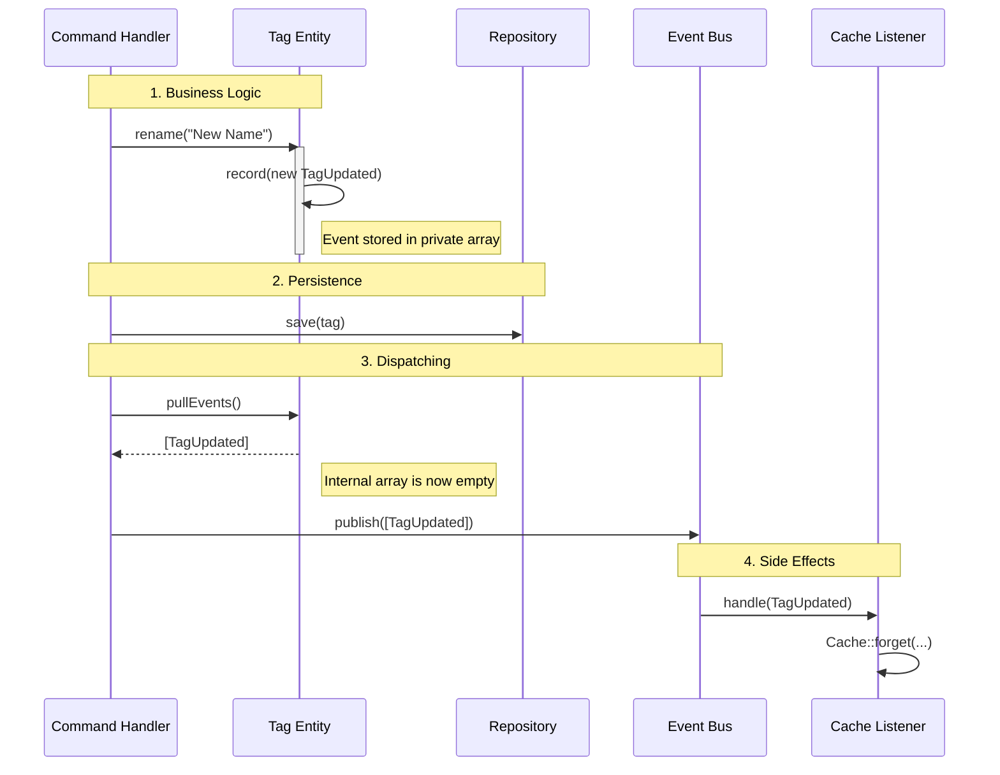

# 🧠 Domain-Driven Design: Event Handling Deep Dive

---

## 1. The Big Picture: Why use an Event Bus? 🚌

In a strict DDD Modular Monolith, we use an **Event Bus** to achieve **Decoupling** and **Separation of Concerns**.

### The Problem it Solves

Without an Event Bus, your Command Handlers become "God Methods" that know too much:

```php
// ❌ Bad Architecture
public function handle(UpdateTagCommand $cmd) {
    $tag->rename($cmd->name);
    $repo->save($tag);
    
    // Tightly coupled side effects:
    Cache::forget('tag:'.$tag->id); // ⚠️ Handler knows about Cache
    Log::info('Renamed');           // ⚠️ Handler knows about Logging
    Mail::to('admin')->send(...);   // ⚠️ Handler knows about Mail
}
```

### The Solution

The Event Bus allows the Handler to focus on **one thing**: orchestrating the business logic. Side effects are delegated to Listeners.

* **Decoupling:** The Domain doesn't know about Infrastructure (Cache/Mail).
* **Extensibility:** You can add a new side effect (e.g., "Send Slack Notification") by creating a Listener, without touching the original Handler code.
* **Transaction Control:** Events are usually published *after* the database transaction commits, ensuring we don't send emails for data that failed to save.

---

## 2. The Mechanics: Inside the Entity (`Tag.php`) ⚙️

To make this work, the Entity needs a way to "remember" what happened to it without talking to the outside world immediately.

### 📝 `private function record(object $event): void`

**Purpose:** The Internal Journal.

* **Why Private?** Only the Entity itself knows when a valid business state change has occurred. External classes should not be able to force an entity to record an event.
* **What it does:** It pushes a Domain Event object (e.g., `TagCreated`, `TagUpdated`) into a private internal array (`$this->events`).
* **Metaphor:** Writing a note in a diary. "Dear Diary, today I changed my name."

```php
public function rename(TagName $name): void
{
    $this->name = $name;
    // We record the fact, but we don't dispatch it yet.
    $this->record(new TagUpdated($this));
}
```

### 📤 `public function pullEvents(): array`

**Purpose:** The Release Mechanism.

* **What it does:**
    1. Returns all recorded events currently in the internal array.
    2. **Clears** the internal array (resets it to empty).
* **Why Clear?** This ensures that if the Entity is reused or processed twice in the same request (rare but possible), the same events are not dispatched multiple times. It signifies a "handover" of responsibility.
* **Usage:** It is called by the **Command Handler** just before publishing to the bus.

```php
// Inside Tag.php
public function pullEvents(): array
{
    $events = $this->events; // 1. Copy events
    $this->events = [];      // 2. Clear internal storage
    return $events;          // 3. Return copy
}
```

---

## 3. The Lifecycle Flow 🔄

Here is how the data flows from the Entity to the Infrastructure.



---

## 4. Summary

| Component | Visibility | Responsibility |
| :--- | :--- | :--- |
| **`EventBus`** | `Interface` | The bridge that moves events from the Application layer to Infrastructure listeners. |
| **`record()`** | `private` | **Internal State.** Captures the fact that a business rule was satisfied and state changed. |
| **`pullEvents()`** | `public` | **Handover.** Extracts the captured events so the Application layer can dispatch them. |

This architecture ensures your **Domain remains pure** (no Laravel dependencies) while your **Application remains modular** (easy to extend).
