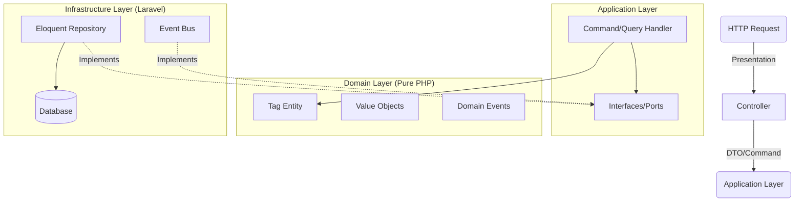

# 🏗️ Tag Module: Technical Architecture & Implementation Guide

---

## 1. Executive Summary

The `Tag` module is a reference implementation of **Strict Domain-Driven Design (DDD)** within a Laravel Modular Monolith. It is designed to be:

* **Self-Contained:** No hard dependencies on other modules.
* **Framework-Agnostic (Domain):** The core business logic (Domain) does not depend on Laravel.
* **Scalable:** Uses CQRS (Command Query Responsibility Segregation) principles to separate reads from writes.
* **Defensive:** Validates data at the boundaries (Value Objects) and enforces invariants.

---

## 2. High-Level Architecture (The "Why")

We use a **Hexagonal Architecture (Ports & Adapters)**. Data flows **inward** toward the Domain.

### Key Decisions & Rationale

1. **Strict Layering:**
    * **Presentation:** Only handles HTTP (Requests, Responses, Inertia). *Why?* To allow swapping the UI (e.g., API vs Web) without touching business logic.
    * **Application:** Orchestrates the flow (Transaction -> Domain -> Repo -> Event). *Why?* To keep the Domain focused on *rules*, not *process*.
    * **Domain:** Pure PHP classes. *Why?* To make business rules testable in isolation (Unit Tests) and portable.
    * **Infrastructure:** Concrete implementations (Eloquent, Redis). *Why?* To isolate framework coupling.

2. **CQRS-Lite:**
    * **Writes (Commands):** Go through `CommandHandlers` -> `Repositories`.
    * **Reads (Queries):** Go through `QueryHandlers` -> `ReadModels`.
    * *Rationale:* Reads are often complex (filtering, sorting) and don't need the overhead of Hydrating full Entities. Writes need strict rule enforcement. Separating them optimizes both.

---

## 3. Detailed Component Breakdown

### 3.1. Domain Layer (`src/Domain`)

**The Heart of Software.** Contains strictly typed business rules.

* **`Entities/Tag.php`**:
  * **Immutable-ish:** State changes via specific methods (`rename`, `changeSlug`) which record events.
  * **Private Constructor:** Forces use of `create()` (new) or `reconstitute()` (from DB).
  * **Event Recording:** Uses `record()` to track changes internally. `pullEvents()` releases them.
  * *Why?* Ensures a Tag is never in an invalid state.

* **`ValueObjects/` (`TagName`, `TagSlug`, `TagId`)**:
  * **Self-Validating:** Constructor throws exception if data is invalid (empty, regex, length).
  * **Constants:** `MAX_LENGTH` exposed for reuse in UI/Validation.
  * *Why?* "Parse, don't validate." Once you have a `TagSlug` object, you *know* it's valid. No need to check regex again.

* **`Events/` (`TagCreated`, `TagUpdated`)**:
  * Simple DTOs carrying state.
  * *Why?* To notify the outside world (Infrastructure) about side effects without coupling the Domain to them.

* **`Exceptions/` (`TagInUseException`)**:
  * Domain-specific errors.
  * *Why?* To translate low-level SQL errors (Integrity Constraint) into meaningful business errors ("Cannot delete used tag").

### 3.2. Application Layer (`src/Application`)

**The Traffic Controller.** Orchestrates the dance between Domain and Infrastructure.

* **`CommandHandlers/` (`CreateTagHandler`)**:
  * **Flow:**
        1. Start Transaction (`TransactionManager`).
        2. Create Entity (`Tag::create`).
        3. Persist (`Repository::save`).
        4. Publish Events (`EventBus::publish`).
  * *Why?* Ensures atomicity. If saving fails, no event is sent.

* **`Ports/` (`EventBus`, `TransactionManager`, `TagRepository`)**:
  * **Interfaces Only.**
  * *Why?* Dependency Inversion. The Application layer defines *what* it needs, Infrastructure defines *how* to do it.

### 3.3. Infrastructure Layer (`src/Infrastructure`)

**The Framework Glue.** Where Laravel lives.

* **`Persistence/Eloquent/Repositories/EloquentTagRepository`**:
  * Implements `TagRepository` port.
  * **Translation:** Converts `Tag` Entity <-> `TagModel` (Eloquent).
  * **Error Handling:** Catches `QueryException` (SQL 23000) and throws `TagInUseException`.
  * *Why?* Keeps Eloquent leakage out of the Domain.

* **`Persistence/Eloquent/ReadModels/CachingTagReader`**:
  * **Decorator Pattern:** Wraps `EloquentTagReader`.
  * **Caching:** Caches results based on search/sort/page keys.
  * *Why?* Separation of concerns. The "logic to find tags" is separate from the "logic to cache tags".

* **`Listeners/TagCacheInvalidator`**:
  * Listens to `TagUpdated` / `TagDeleted`.
  * Clears specific cache keys.
  * *Why?* Reactive consistency. The `Handler` doesn't need to know about Caching.

### 3.4. Presentation Layer (`src/Presentation`)

**The Interface.**

* **`Controllers/Admin/TagController`**:
  * **Thin:** No logic. Just authorization, validation, and delegation.
  * **Mappers:** Uses `CreateTagCommandMapper` to convert HTTP Request -> Command DTO.
  * *Why?* Testing controllers is hard. Testing Handlers is easy. Keep controllers dumb.

* **`Requests/` (`StoreTagRequest`)**:
  * Uses `TagSlug::REGEX` and `TagName::MAX_LENGTH`.
  * *Why?* Single Source of Truth. If Domain rules change, Validation rules update automatically.

---

## 4. Cross-Cutting Concerns

### 4.1. Transactions

* **Strict Rule:** Handlers manage transactions, not Repositories.
* **Tool:** `TransactionManager` port.
* **Why?** Allows composing multiple repositories in one atomic operation.

### 4.2. Events & Side Effects

* **Flow:** Entity records -> Handler pulls -> Bus publishes -> Listener reacts.
* **Why?** If we want to add "Email on Tag Delete", we just add a Listener. We don't touch the `DeleteTagHandler` (Open/Closed Principle).

### 4.3. Caching Strategy

* **Tagging:** Uses `Cache::tags()` where available.
* **Keys:** `tag:find:{id}` and `tag:list:{hash}`.
* **Invalidation:** Event-driven.

---

## 5. Risk Analysis & "Gotchas"

1. **Event ID Latency:**
    * *Risk:* `TagCreated` event is recorded *before* the DB assigns an auto-increment ID. The payload inside the event has `id=null`.
    * *Mitigation:* If listeners need the ID, fetch it fresh from DB or switch to Client-Side UUIDs (recommended for v2).

2. **Performance:**
    * *Risk:* Converting Eloquent Models to Entities (Hydration) is slower than raw arrays.
    * *Mitigation:* Use `ReadModels` (returning DTOs) for lists/reads. Only use Entities for Writes/Business Logic.

3. **Boilerplate:**
    * *Risk:* Lots of files (Command, Handler, Request, Mapper).
    * *Mitigation:* Explicit code is easier to maintain than magic code. Generative AI (like Gemini) handles the boilerplate generation easily.

---

## 6. How to Extend (Cookbook)

### "I want to add a `Color` to the Tag."

1. **Domain:**
    * Add `TagColor` Value Object.
    * Add `$color` property to `Tag` Entity.
    * Update `Tag::create` and `Tag::reconstitute`.
2. **Infrastructure:**
    * Add `color` column to `tags` table migration.
    * Update `TagModel` `$fillable`.
    * Update `TagMapper`.
3. **Application:**
    * Update `CreateTagCommand` and `TagDTO`.
    * Update `CreateTagHandler` (pass color).
4. **Presentation:**
    * Update `StoreTagRequest` validation.
    * Update `CreateTagCommandMapper`.
    * Update Inertia View.

*This structure ensures you never "miss" a spot. The compiler (and types) will guide you.*
