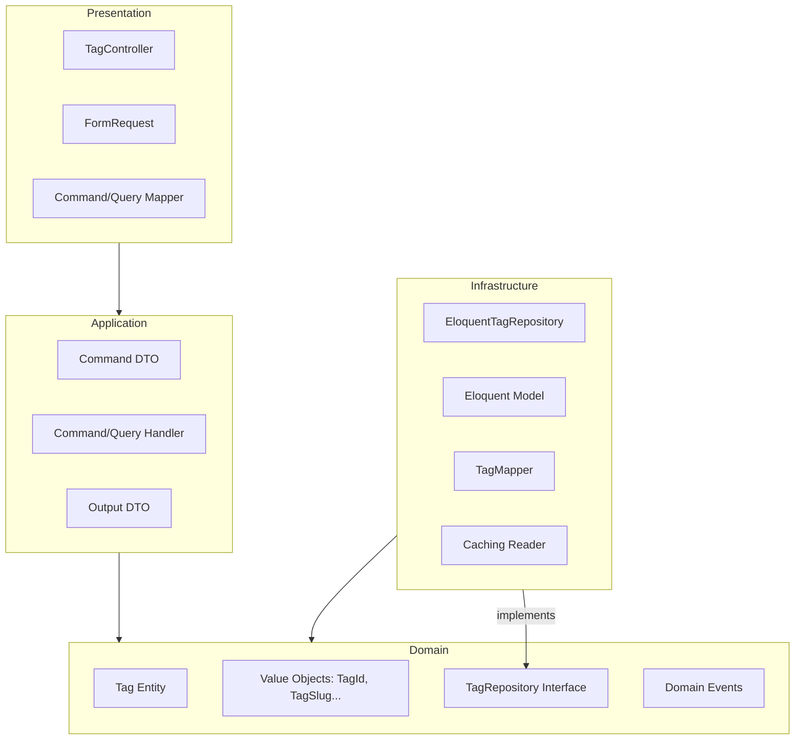
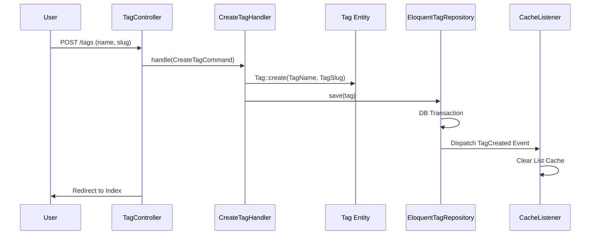
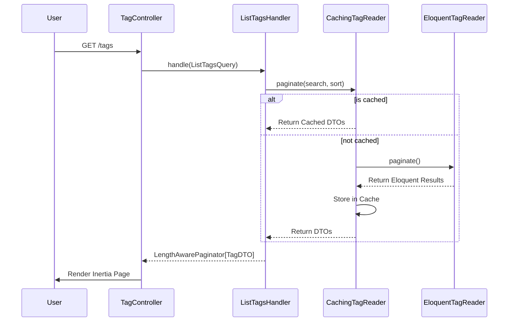
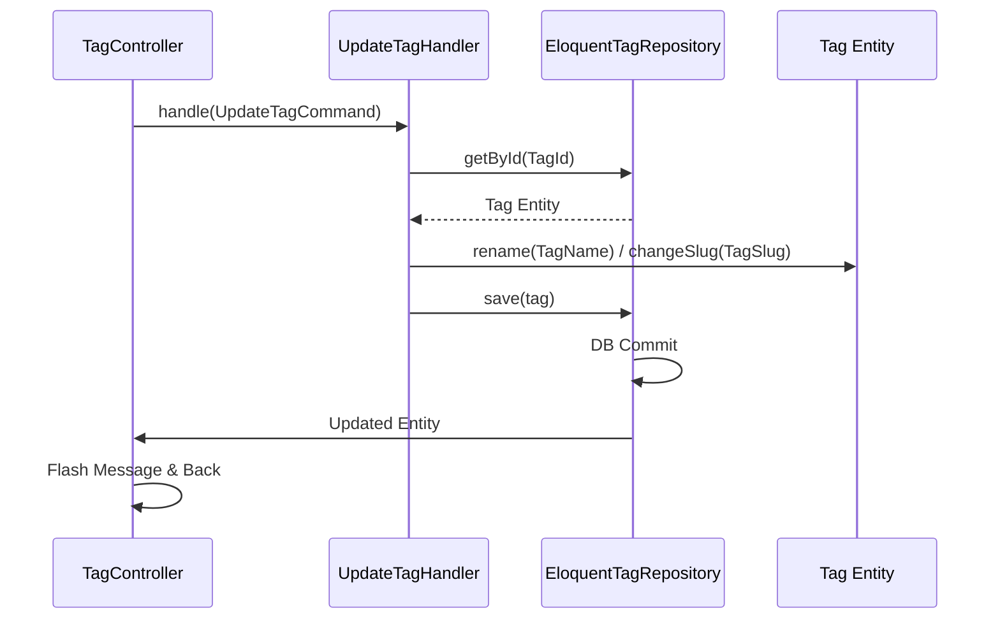
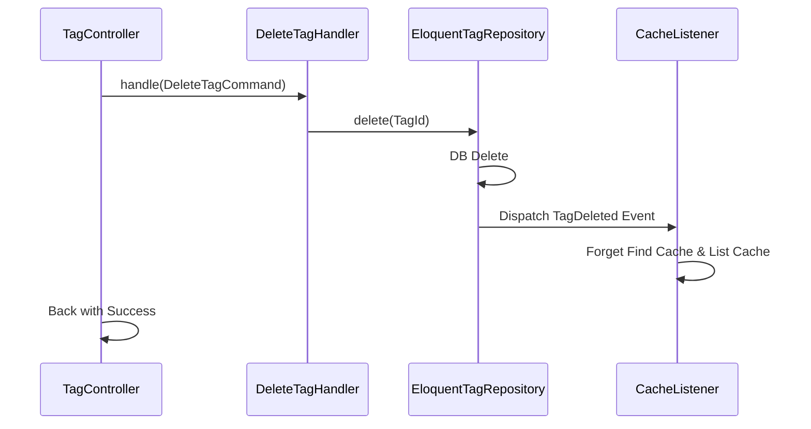

# 🏷️ Tag Module: The Ultimate Architectural Deep Dive

This document serves as the definitive guide to the `Tag` module. It explores the intricate class relationships, dependency management, data lifecycles, and the underlying "Why" behind this DDD (Domain-Driven Design) implementation.

---

## 🏛️ 1. The Core Philosophy: "Domain is King"

In this architecture, the **Domain** is the center of the universe. All other layers (Presentation, Application, Infrastructure) exist only to serve or support the Domain.

### 🧩 Architectural Overview

### 📏 The Inward Dependency Rule

* **Presentation ➡️ Application ➡️ Domain**
* **Infrastructure ➡️ Application / Domain** (Implementing interfaces)
* **Domain ➡️ Nothing**

---

## 🔌 2. Class Communication & Dependency Injection (DI)

We strictly avoid the `new` keyword for any class that contains logic. Instead, we use **Constructor Injection**.

### 🛠️ The Service Container (The Electrician)

The `TagServiceProvider` is the "Glue". It tells Laravel how to build complex objects.

* **Binding Interfaces**: When a Handler asks for `TagRepository`, Laravel looks at the Service Provider and sees it should provide `EloquentTagRepository`.
* **Automatic Resolution**: If `EloquentTagRepository` needs a `TagMapper`, Laravel automatically creates the mapper and injects it.

---

## 🔄 3. Full CRUD Flows

### 🆕 CREATE Flow

### 🔍 READ Flow (Caching)

### 📝 UPDATE Flow

### 🗑️ DELETE Flow

---

## 💎 4. Key Design Patterns Used

### 1️⃣ Command-Query Separation (CQS) ⚔️

We separate "Writing" from "Reading".

* **Write Path**: Use Handlers, Commands, and Entities. Focus is on business rules and data integrity.
* **Read Path**: Use QueryHandlers and DTOs. Focus is on speed, pagination, and caching.

### 2️⃣ The Decorator Pattern (Caching) 🎀

Look at `CachingTagReader`. It wraps `EloquentTagReader`.

* The `CachingTagReader` handles the caching logic.
* The `EloquentTagReader` handles the raw DB queries.
* The Service Provider decides how to "nest" them.

### 3️⃣ Data Mapper Pattern 🗺️

`TagMapper` keeps the Domain Entity and the Database Model separate.

* **Model**: Talks to Laravel/DB.
* **Entity**: Pure PHP, talks business rules.
* **Benefit**: You can change your DB schema without breaking your Domain.

---

## 🏗️ 5. Implementation "Glue": The Service Provider

| Method | 🛠️ Role |
| :--- | :--- |
| `register()` | Binds interfaces to implementations. Sets up **Singletons**. |
| `boot()` | Sets up framework features: Routes, Policies, Event Listeners. |
| `mergeConfigFrom` | Merges module defaults with the main app config. |
| `runningInConsole` | Ensures "setup" logic only runs in CLI mode. |

---

## ⚖️ 6. Advantages vs. Disadvantages

### ✅ The Pros

* **Testability**: Test logic without a database.
* **Isolation**: Bugs in one module can't "bleed" into others.
* **Cognitive Clarity**: You always know where the "rules" live.
* **Zero Side Effects**: Value Objects prevent "dirty" data.

### ❌ The Cons

* **File Explosion**: A simple CRUD requires ~15 files.
* **Complexity**: Higher learning curve for new developers.
* **Speed**: Initial development is slower than "Standard Laravel".

---

## 📋 7. Summary of Class Roles

* 🚀 **Controller**: Entry/Exit.
* 🛡️ **Request**: Validation.
* 🗺️ **Mapper**: Translation.
* 📦 **Command/Query**: Intention.
* ⚙️ **Handler**: Orchestrator.
* 🌳 **Entity**: Business Logic.
* 💎 **Value Object**: Integrity.
* 💾 **Repository**: Persistence.
* 📖 **Reader**: Retrieval.
* 🔔 **Listener**: Side Effects.
